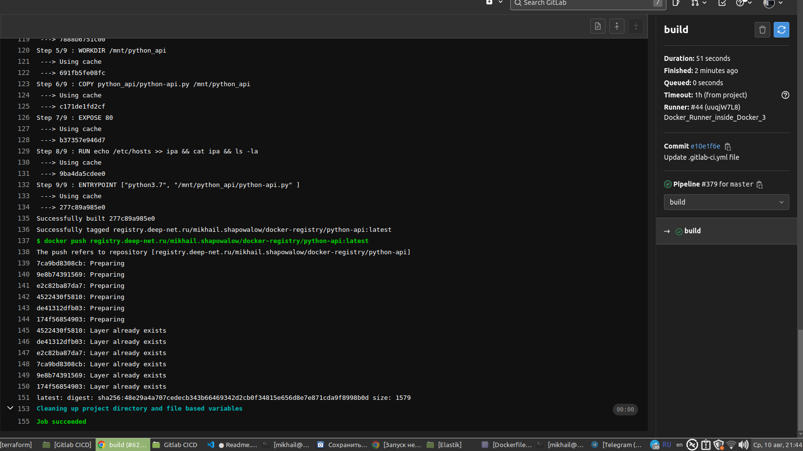
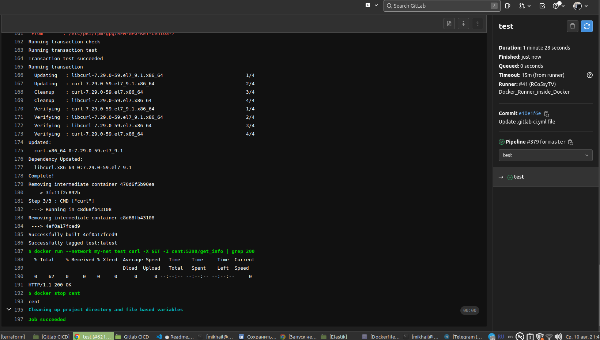

# 09.05 Gitlab
## 1.
[Dockerfile](Dockerfile) во вложении в репозитории
## 2.
[python-api](python_api/python-api.py) во вложении в репозитории
## 3.
[.gitlab-ci.yml](.gitlab-ci.yml) во вложении в репозитории

build

test

после изменений в python file

.png)