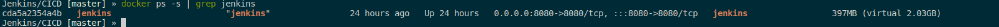

# Проекты для тестирования CI CD систем.
1. Jenkins в докере, докер файл сделан на centos 7 [Jenkins](CICD/Jenkins)
2. Jenkins в докере, докер сделан на debian [Jenkins_](CICD/Jenkins_debian)  
Так же пытался оптимизировать данный докер контейнер. Результат можно посмотреть на фото.  

  

Можно понять, что образ достаточно не легкий, но в Jenkins на данном этапе были уже загруженны необходимые плагины и утилиты.  

3. gitlab ci cd. Развертывание приложения написанного на python с помощью докер контейнера [Gitlab](CICD/Gitlab_CICD)
4. gitlab yml файл для сборки и загрузки артефактов в репозиторий данного проекта. [Gitlab.yml](CICD/.gitlab-ci.yml)
